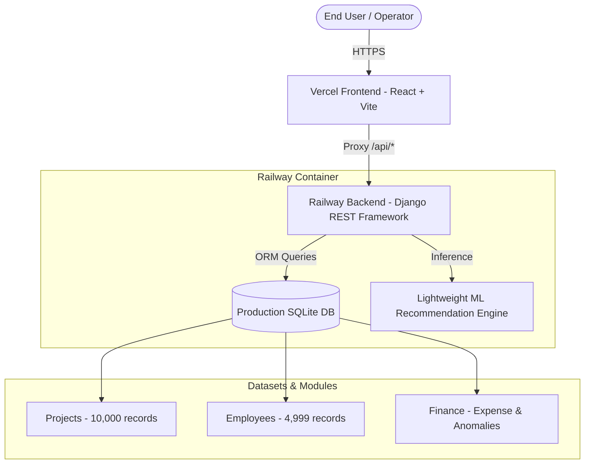

# AI Business Operations Management Platform

[](https://ai-business-operations-management-p-kappa.vercel.app/)
[](https://ai-business-operations-management-platform-production.up.railway.app/api/health/)
[](https://www.djangoproject.com/)
[](https://react.dev/)
[](https://vitejs.dev/)

An enterprise-grade, end-to-end intelligent business operations platform designed for automated resource allocation, workforce analytics, financial tracking, and machine learning-powered decision support.

---

## 🌐 Live Production Deployments

| Component | Provider | Live URL | Description |
|---|---|---|---|
| **Frontend Application** | Vercel | [https://ai-business-operations-management-p-kappa.vercel.app/](https://ai-business-operations-management-p-kappa.vercel.app/) | React SPA with real-time UI, pagination, and analytics dashboards |
| **Backend REST API** | Railway | [https://ai-business-operations-management-platform-production.up.railway.app/](https://ai-business-operations-management-platform-production.up.railway.app/) | Django REST framework API and ML inference engine |
| **Health Check** | Railway | [`/api/health/`](https://ai-business-operations-management-platform-production.up.railway.app/api/health/) | Instant service and health status monitor |

---

## 🏗️ System Architecture



### Key Architectural Decisions:
1. **Reverse Proxy Architecture**: The Vercel frontend automatically proxies all `/api/*` requests directly to the Railway production API via `ui/vercel.json`, completely eliminating browser Cross-Origin Resource Sharing (CORS) complexities.
2. **Lightweight ML Model Deployment**: An optimized Random Forest / Decision Tree model (`models/employee_recommendation_model_lite.pkl`) is loaded in-memory with strict memory constraints (<100MB RAM), preventing container memory pressure during multi-tenant inference.
3. **High-Performance Client-Side Pagination**: Smooth client-side slicing (20 items per page) with adaptive page number controls and instant debounced search over datasets containing up to 10,000 records.

---

## ✨ Features & Modules

### 1. 📊 Executive Dashboard
- Comprehensive business operational metric cards: Total Employees (4,999), Total Tasks (50,000), Average Workload (55.66%), and Average Performance Score (69.71%).
- Real-time task progress indicators and employee availability status breakdowns (Available, Busy, On Leave).

### 2. 📁 Project Management
- **Dataset**: 10,000 enterprise project records loaded directly from production.
- **Pagination**: Professional 20-item per page pagination with `Previous`, `Next`, and adaptive smart page numbers (`1`, `2`, `3`, `4`, `5`, `...`, `500`).
- **Dynamic Search**: Instant filtering across Project ID, Project Name, Status, Risk Level, and Description.
- **Status & Risk Indicators**: Color-coded badges for project lifecycle (`In Progress`, `Completed`, `Not Started`) and risk levels (`Low`, `Medium`, `High`, `Critical`).

### 3. 👥 Employee Management
- **Dataset**: 4,999 employee profiles with rich skill sets and operational attributes.
- **Pagination**: 20 employees per page (`Showing 1–20 of 4,999 employees`) with smart page navigation.
- **Full-Text Filter**: Multi-attribute search across Employee Name, Department, Job Role, Email, Skills, and Availability Status.
- **Workload Monitoring**: Availability status indicators (`Available`, `Busy`, `On Leave`) and workload percentage tracking.

### 4. 💰 Financial Operations & Expense Tracking
- **Real-Time Tracking**: Tracks active departmental expenses with anomaly detection.
- **Metric Cards**: Dynamic aggregation of Total Tracked Budget ($64,050.00), Approved Expenses, Pending Approvals, and Flagged Anomalies.
- **Live Backend Integration**: Full persistence with Django REST backend `/api/finance/`.

### 5. 🤖 AI Recommendations & ML Predictions
- **Skill-Task Matching**: Machine learning recommendation model dynamically matches available employees to incoming task requirements based on skill affinity, historical performance, and workload.
- **Task Completion Prediction**: Predicts task duration and likelihood of on-time delivery using trained decision tree and random forest regressors.

---

## 📡 REST API Reference

All endpoints are accessible via the Railway production domain or via the Vercel proxy at `/api/*`.

| Method | Endpoint | Description |
|---|---|---|
| `GET` | `/api/health/` | Service health status |
| `GET`, `POST` | `/api/projects/` | List all projects or create a new project |
| `GET`, `PUT`, `DELETE` | `/api/projects/<project_id>/` | Retrieve, update, or delete a specific project |
| `GET`, `POST` | `/api/employees/` | List all employees or create a new employee profile |
| `GET`, `PUT`, `DELETE` | `/api/employees/<employee_id>/` | Retrieve, update, or delete an employee record |
| `GET`, `POST` | `/api/finance/` | List all financial transactions or record a new expense |
| `GET`, `PUT`, `DELETE` | `/api/finance/<finance_id>/` | Retrieve, update, or delete a financial transaction |
| `GET` | `/api/recommendations/?top_n=5` | Get top-N AI recommended employees for tasks |
| `POST` | `/api/ml/task-completion/` | Predict completion metrics and hours for a given task |

---

## 💻 Local Development Setup

### Prerequisites
- **Python**: 3.11+
- **Node.js**: 18+ and `npm`
- **Git**

### 1. Clone the Repository
```bash
git clone https://github.com/rjvibez/AI-Business-Operations-Management-Platform-.git
cd AI-Business-Operations-Management-Platform-
```

### 2. Backend Setup (Django)
```bash
cd backend
python -m venv .venv

# On Windows:
.venv\Scripts\activate
# On macOS/Linux:
source .venv/bin/activate

pip install -r ../requirements.txt
python manage.py migrate
python manage.py runserver 8000
```
Backend API will be running at `http://127.0.0.1:8000/api/`.

### 3. Frontend Setup (React + Vite)
```bash
cd ../ui
npm install
npm run dev
```
Frontend will be running at `http://localhost:5173/`.

### 4. Running Backend Tests
```bash
cd backend
python manage.py test api
```

---

## 🚀 Deployment Guide

### Deploying the Backend to Railway
1. Fork or push to the target branch (e.g. `vercel-deployment`).
2. In Railway, connect the GitHub repository.
3. Configure the start command using the included `Procfile`:
   ```bash
   web: cd backend && python manage.py migrate --noinput && gunicorn config.wsgi:application --bind 0.0.0.0:$PORT --workers 1 --timeout 120 --max-requests 50 --max-requests-jitter 10
   ```
4. Generate a public domain under service networking settings.

### Deploying the Frontend to Vercel
1. Set the root directory in Vercel to `ui` or deploy from root with `ui/vercel.json`.
2. Build command: `npm run build`
3. Output directory: `dist`
4. Update `ui/vercel.json` to proxy API requests to your live Railway backend domain:
   ```json
   {
     "rewrites": [
       {
         "source": "/api/(.*)",
         "destination": "https://<your-railway-backend-domain>/api/$1"
       },
       {
         "source": "/(.*)",
         "destination": "/index.html"
       }
     ]
   }
   ```
5. Deploy: `npx vercel --prod`

---

## 🔒 Security & Environment Configuration

- **Environment Isolation**: Production settings use strict `ALLOWED_HOSTS` and CORS restrictions.
- **Sensitive Secrets**: No database passwords, secret keys, or internal credentials are committed to version control.
- **Ephemeral State**: Containerized stateless architecture with lightweight persistent storage for operational data.

---

## 👥 Contributors & Maintainers
- **Team RP2** / **Rajesh Mani** (Lead Architecture & Implementation)